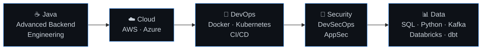

<!-- ===================== HEADER ===================== -->

<h1>Hi 👋, I'm Katlego Mashego</h1>

 

  

 

---

## 👨‍💻 About Me

I'm a **software engineer focused on backend development with Java and Spring Boot**, and I'm deliberately expanding into **cloud engineering, DevOps, security and data engineering**.

I enjoy building **production-style systems rather than only tutorials**: authentication and authorization with Keycloak, CI/CD pipelines, container builds, vulnerability scanning, metrics and dashboards, and clean API design. The goal is software that is secure, observable and ready to run, not just software that works on my laptop.

| 🎯 Focus | ☁️ Growing into | 🔐 Care about |
|:---:|:---:|:---:|
| Backend engineering | Cloud and DevOps | Security by design |
| Java · Spring Boot | Data engineering | Observability |

---

## 🚀 What I'm Working On

<table>
  <tr>
    <td width="33%" valign="top">
      <h3>🎫 SmartDeskSupport</h3>
      
AI-powered IT service desk and ticketing system with full ticket lifecycle management and AI-assisted resolution.

      <b>Spring Boot · REST APIs · Keycloak · OAuth2/OIDC · Docker · GitHub Actions · Prometheus · Grafana</b>
    </td>
    <td width="33%" valign="top">
      <h3>💳 PayBridge</h3>
      
Payment gateway abstraction built around provider switching, routing, failover and webhook-driven integrations.

      <b>Spring Boot · Provider abstraction · Routing · Failover · Webhooks · Event-driven design</b>
    </td>
    <td width="33%" valign="top">
      <h3>⚛️ QuantumKat Solutions</h3>
      
Software solutions initiative delivering web applications, business automation, internal systems and AI-powered tools.

      <b>Web apps · Automation · Internal systems · AI solutions</b>
    </td>
  </tr>
</table>

---

## 🛠️ Tech Stack

| | |
|:--|:--|
| **Languages** |  &nbsp;+ SQL |
| **Backend** |   Spring Boot · Spring Security · REST APIs · Microservices · JPA/Hibernate |
| **Databases** |   Database design and optimization |
| **Cloud** |  |
| **DevOps** |   CI/CD · Infrastructure concepts |
| **Security** |      Spring Security · API security · DevSecOps · Vulnerability scanning |
| **Observability** |   Spring Boot Actuator · Metrics · Logging and monitoring |
| **Data Engineering** |     SQL · Python · ETL/ELT · Data pipelines · Cloud data platforms |

---

## 📊 GitHub Stats

<table>
  <tr>
    <td align="center" width="50%">
      
    </td>
    <td align="center" width="50%">
      
    </td>
  </tr>
</table>

  

<picture>
  <source media="(prefers-color-scheme: dark)" srcset="https://raw.githubusercontent.com/YOUR_USERNAME/YOUR_USERNAME/output/github-snake-dark.svg" />
  <source media="(prefers-color-scheme: light)" srcset="https://raw.githubusercontent.com/YOUR_USERNAME/YOUR_USERNAME/output/github-snake.svg" />
  
</picture>

---

## 🧠 Currently Learning

| Track | Direction | Focus |
|:--|:--|:--|
| ☕ **Java** | Advanced Backend Engineering | Deeper Spring, performance, clean architecture |
| ☁️ **Cloud** | AWS / Azure | Cloud-native deployment and services |
| 🐳 **DevOps** | Docker / Kubernetes / CI/CD | Automated build, test, ship pipelines |
| 🔐 **Security** | DevSecOps / Application Security | Secure code, scanning, identity |
| 📊 **Data** | SQL / Python / Kafka / Databricks / dbt | Pipelines and cloud data platforms |

---

## 🏗️ Engineering Interests

| | | |
|:--|:--|:--|
| 🌐 Distributed systems | 🧩 Microservices | ⚡ Event-driven architecture |
| 🔌 API design | ☁️ Cloud-native applications | 🛡️ DevSecOps |
| 📊 Data engineering | 🤖 AI-assisted applications | 💳 Payment systems |
| 🕵️ Fraud detection | | |

---

## 📌 Featured Projects

| Project | Description | Tech Stack | Repository | Status |
|:--|:--|:--|:--|:--:|
| **🎫 SmartDeskSupport** | AI-powered IT service desk and ticketing system with secure authentication, ticket lifecycle management and AI-assisted resolution. | Spring Boot, REST APIs, Keycloak, OAuth2/OIDC, Docker, GitHub Actions, Prometheus, Grafana | [View repo](YOUR_SMARTDESKSUPPORT_REPO_URL) | 🚧 In progress |
| **💳 PayBridge** | Payment gateway abstraction with provider routing, failover, webhooks and an event-driven design. | Spring Boot, Webhooks, Event-driven architecture | [View repo](YOUR_PAYBRIDGE_REPO_URL) | 🚧 In progress |
| **⚛️ QuantumKat Solutions** | Software solutions covering web apps, business automation, internal systems and AI-powered solutions. | Web applications, Automation, AI | [Learn more](YOUR_QUANTUMKAT_URL) | 🌱 Active |

---

## 📫 Connect With Me

I'm open to conversations about backend engineering, cloud, DevOps and data roles.

 

